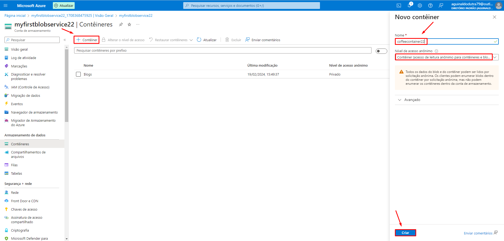

## Cognitive Search in Azure

  

   
  

> Project developed as a challenge - AI-900 Preparation!

## About the project

Using Azure AI Search, I conducted filtered searches on some .DOCX files that were stored inside a container in Azure Blob Storage.
  
## **Creating an Azure AI Search**

## **Creating a Resource**

## **Creating an Azure Blob Storage**

## **Configuring to Allow Anonymous Access**

## **Creating a New Container**

## **Importing Data**

Here, I simply clicked "next" until the end.

## **Searching Comments by Location**  

## Final Considerations
I found it incredible how easy it is to create a Container in Blob Storage within Azure, and it's an amazing experience to perform searches through Azure AI Search. Without a doubt, it's a very useful resource that can be used in various contexts to help companies organize their files.

## 👨‍💼 Autor

<table>
  <tr>
    <td align="center">
      <a href="#">
         
        
          <b>Gian Dutra</b>
        
      </a>
    </td>
  </tr>
</table>
